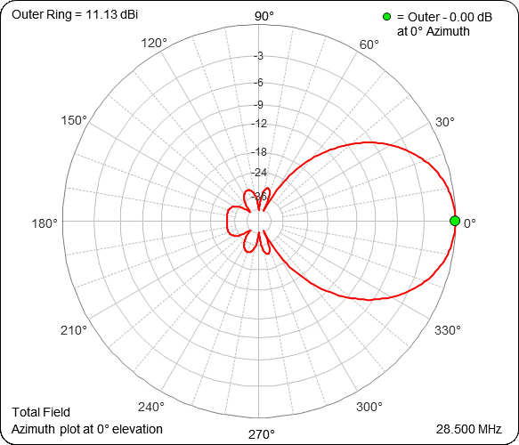
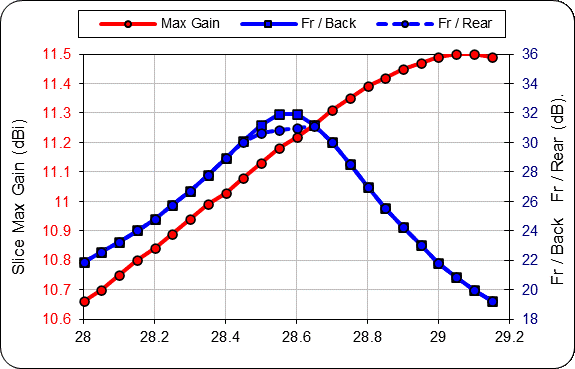
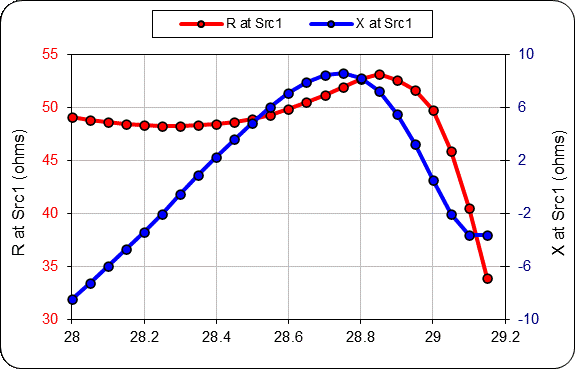
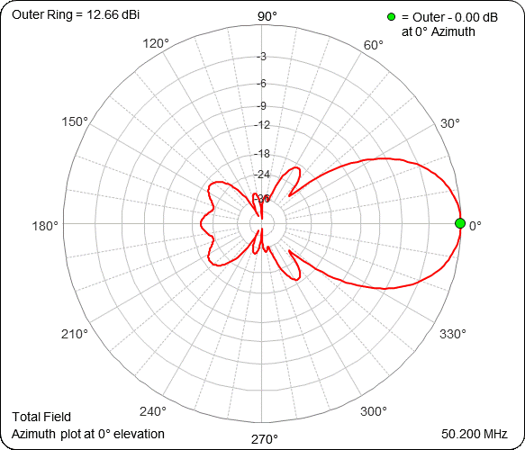
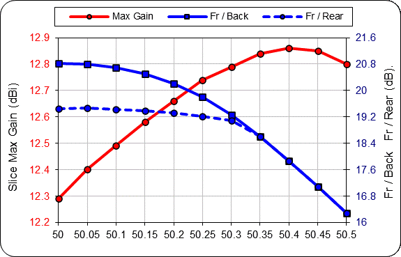
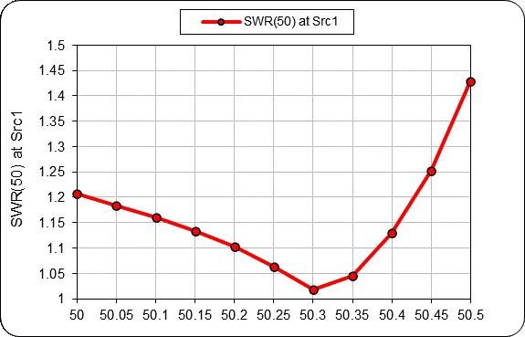
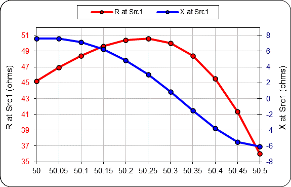

10 m / 6m dual bander with 6+7 elements and 11.5m boom.

Single cable, both band driven elements are directly driven.
6 meter somewhat suffers, but still gain is quite good.

10m band is optimized to have SWR < 1.2 from 28.0 to 29.1MHz
6m band is optimized to have SWR < 1.2 from 50.0 to 50.45 MHz

Modeled EZNEC Pro 7 and NEC-5 calculation engine.

Overall:

| Band        | Gain dBi          | F/B  | SWR |
| ------------- |:-------------:| -----:|-----:|
| 10m      | 11.2 | 32 | < 1.2  |
| 6m      | 12.8      |   20 | < 1.2 |

10m:

6m:

