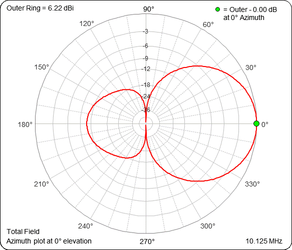
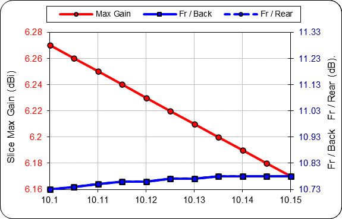
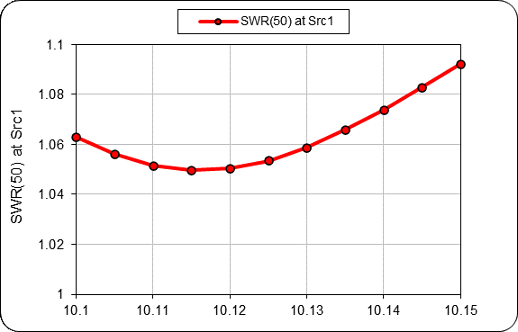
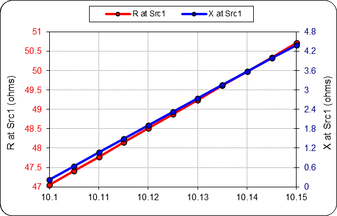
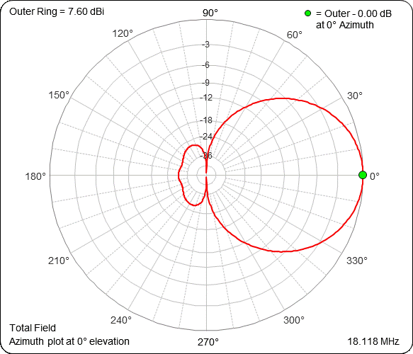
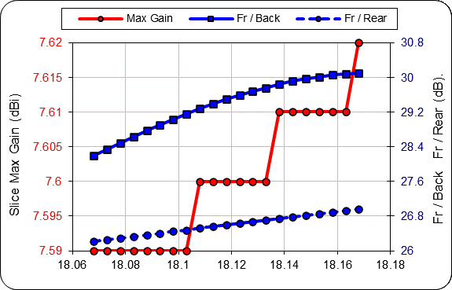
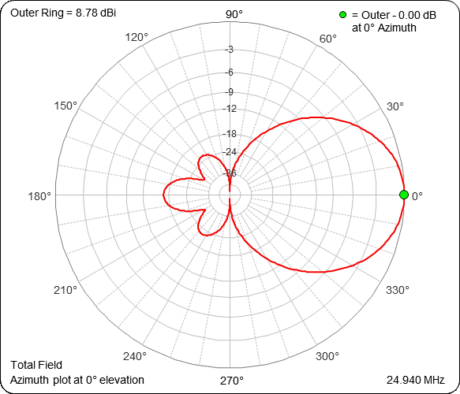
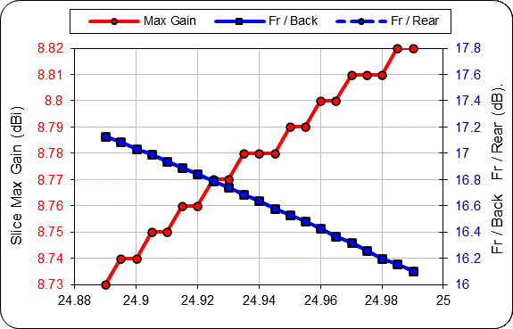
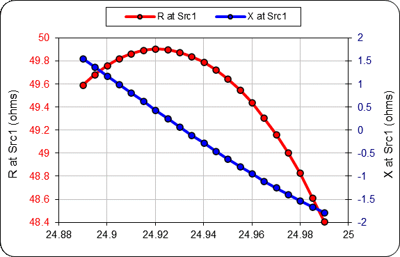

WARC 30 m / 17m / 12 tri bander with 2+3+4 elements.

Single cable, all band driven elements are directly driven.

Modeled EZNEC Pro 7 and NEC-5 calculation engine.

Overall:

| Band        | Gain dBi          | F/B  | SWR |
| ------------- |:-------------:| -----:|-----:|
| 30m      | 5.5 | 9.3 | < 1.08  |
| 17m      | 7.5      |   28.5 | < 1.17 |
| 12m | 8.0      |   18.8 | < 1.02 |

30m:

17m:

12m:

